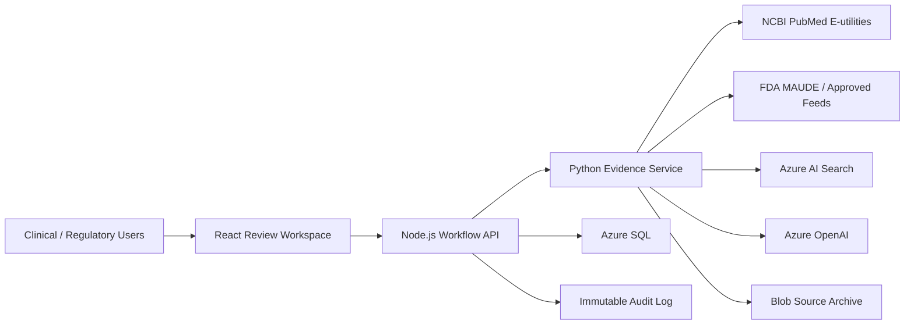

# Production Architecture

## Core workflow
1. Approve review protocol and eligibility criteria.
2. Execute and version source-specific search strategies.
3. Import citations and preserve source metadata.
4. Deduplicate deterministically with human resolution for uncertain matches.
5. Perform dual screening with conflict adjudication.
6. Extract PICO/PIRO, performance endpoints, limitations, and applicability.
7. Appraise quality and risk of bias using configured instruments.
8. Detect contradictory evidence and evidence gaps.
9. Draft CER/PER/PMS sections grounded in accepted evidence only.
10. Require independent review and controlled approval.

## Azure deployment
Use App Service or Container Apps with VNet integration, private endpoints, managed identities, Key Vault, Azure SQL, Blob immutable storage policies, Azure AI Search security filters, Application Insights, Defender for Cloud, and separate development/validation/production subscriptions or resource groups.
